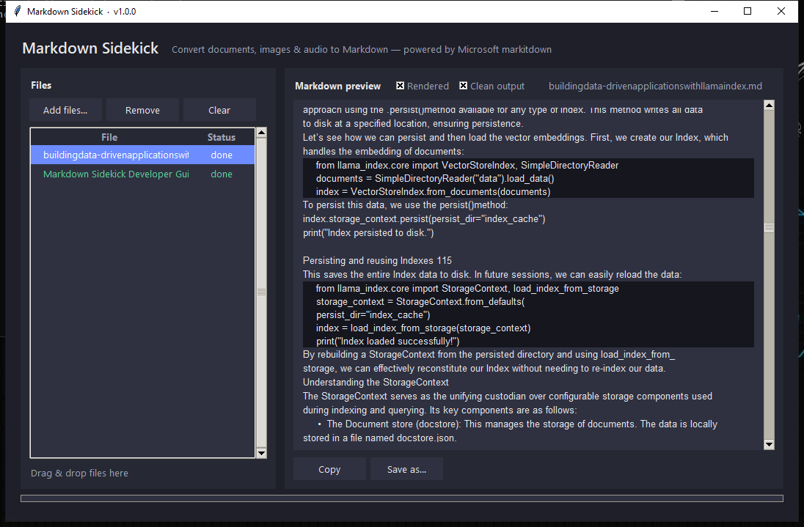

# Markdown Sidekick

A simple Windows desktop app that converts files into Markdown using Microsoft's
[markitdown](https://github.com/microsoft/markitdown) engine. Drop in PDFs, Office
documents, images, audio, HTML and more — get clean Markdown out.

Markdown Sidekick is **freeware** by VibeProSoft. If it saves you time, you can
support development:

<a href='https://ko-fi.com/O6K81ZYB9P' target='_blank'></a>



📖 **New here? Read the [User Guide](src/markdown_sidekick/USERGUIDE.md)** — also
available inside the app via the **❓ User Guide** button.

## Features

- **Drag & drop** files onto the window, or pick them with **Add files…**
- **Batch convert** any number of files at once (runs off the UI thread, so the app
  stays responsive)
- **Live Markdown preview** of each converted file, with a **Rendered** toggle that
  styles headings, bold/italic, lists, tables, links and fenced code — or switch to
  raw Markdown
- **Clean output** pass (on by default) that tidies the raw markitdown text:
  - normalizes PDF ligatures (fi→fi), soft hyphens, and replacement-char runs
  - strips leaked page numbers (arabic + roman) and recurring running-headers
  - removes Table-of-Contents / index blocks in *any* form — scrambled tables,
    dot-leader lines, "Section • 26" entries — while preserving real data tables
  - promotes book chapter titles to real `# Chapter N: …` headings
  - removes publisher boilerplate blocks repeated throughout a document
  - auto-fences detected code listings with a **guessed language** (python, go,
    csharp, cpp, ruby, kotlin, java, javascript), merges fragmented fences and
    tightens double-spaced listings
  - converts "•" bullets to Markdown lists and repairs sheared bullet lists
  - joins hard-wrapped prose lines and rejoins hyphen-split words
  - collapses excessive blank lines
- **Local audio transcription** (on by default) for MP3/WAV/M4A/FLAC/OGG:
  - timestamped Markdown transcript with detected language
  - **no system `ffmpeg` required** — FFmpeg ships inside the `faster-whisper`/PyAV
    wheels; CPU (int8) by default, CUDA (float16) when an NVIDIA GPU is present
  - the Whisper model downloads once on first use to `%LOCALAPPDATA%`
- **Local OCR pipeline** (on by default) for content markitdown can't read:
  - **images** (PNG/JPG/BMP/TIFF/WEBP) are run through OCR to extract their text
  - **scanned / image-only PDFs** are auto-detected and OCR'd page-by-page, while
    digital PDFs stay on the faster markitdown path (smart routing)
  - each file shows which engine produced it (`markitdown` / `ocr` / `ocr+text`)
  - fully **offline & CPU-only** — powered by [RapidOCR](https://github.com/RapidAI/RapidOCR)
    (ONNX, Apache-2.0, models bundled — no download, no GPU, no cloud)
- **Settings panel** (⚙ in the header), persisted to `%LOCALAPPDATA%`: toggle OCR /
  audio, pick the Whisper model size, set a default output folder, choose preview
  defaults, and configure an optional **MinerU** high-fidelity endpoint
- **MinerU high-fidelity mode** (optional): point the app at a local MinerU server
  and PDFs route to it for layout-aware Markdown, with automatic fallback to the
  built-in OCR / markitdown pipeline if it's unreachable
- **AI-friendly export** (Settings → *AI-friendly export*):
  - **YAML front matter** on saved files (title, source, date, token estimate)
  - **Chapter splitting** — *Save Markdown* can write each book as a folder of
    per-chapter files plus `index.md` and a machine-readable `manifest.json`,
    sized for AI context windows and RAG chunkers
  - **Page anchors** — optional `<!-- page N -->` markers in PDF conversions so
    AI answers can cite the printed page
  - **Figure extraction** — pull embedded PDF images into an `assets/` folder
    with `![Figure]` links (de-duplicated, icons filtered out)
  - **Quality score** in the status bar (structure, artifacts, ~token count)
- **Video transcription** — MP4/MKV/MOV/WEBM/AVI route through the same local
  Whisper pipeline (PyAV decodes the audio track); transcripts are grouped into
  timestamped paragraphs
- **Headless CLI** — `markdown-sidekick-cli convert *.pdf --split-chapters
  --quality` (or `MarkdownSidekick.exe --cli convert …`) for scripts and CI
- **Optional local-LLM extras** (point Settings at an Ollama endpoint; off by
  default, fully offline): artifact **polish** pass with a size guardrail, and
  vision-model **alt-text captions** for extracted figures
- **Copy** the Markdown to the clipboard, or hit the single **💾 Save Markdown…**
  button — one file gets a save dialog, a batch gets a folder (Copy/Save respect
  the Clean-output setting)
- **Per-file status** (done / error) with the error message shown inline in the preview
- Powered by `markitdown[all]`, so it understands a wide range of formats:

  | Category   | Formats |
  |------------|---------|
  | Documents  | PDF, DOCX, PPTX, XLSX/XLS, EPUB |
  | Web/data   | HTML, CSV, JSON, XML, TXT, MD |
  | Images     | PNG, JPG, GIF, BMP, TIFF *(metadata / OCR where available)* |
  | Audio      | MP3, WAV, M4A *(transcription — see notes)* |
  | Archives   | ZIP *(contents are converted recursively)* |

## Getting it running — pick the option that fits you

### Option A — Standalone app (no Python needed)

Grab the one-folder distribution (`dist\MarkdownSidekick\`, ~484 MB) and
double-click **`MarkdownSidekick.exe`**. Nothing to install — Python, the OCR
models, and all native libraries are inside. To build it yourself:

```powershell
.venv\Scripts\pyinstaller.exe MarkdownSidekick.spec --noconfirm
dist\MarkdownSidekick\MarkdownSidekick.exe --selftest   # writes a JSON report to %TEMP%
```

The `--selftest` flag verifies the bundled pipeline (markitdown, OCR, cleanup)
and exits 0 on success — useful before shipping a build to someone.

> **Run the exe from `dist\`, not `build\`.** PyInstaller's `build\` folder is
> intermediate scratch — the exe it leaves there has no runtime next to it and
> fails with "Failed to load Python DLL". Only `dist\MarkdownSidekick\` is the
> complete, shippable app.

### Option B — Install with pip / pipx (Python 3.10+, any OS)

```powershell
pipx install markdown-sidekick          # or: pip install markdown-sidekick
markdown-sidekick                       # launches the GUI
markdown-sidekick-mcp                   # the MCP server (install extra: [mcp])
```

Installing from a local checkout: `pip install .` (add `.[mcp]` for the MCP server).

### Option C — Run from source (Windows)

- Requires Python 3.10+ (built and tested on 3.13)
- Double-click **`setup.bat`** — creates `.venv/` and installs `requirements.txt`

Manual equivalent:

```powershell
py -m venv .venv
.venv\Scripts\python.exe -m pip install -r requirements.txt
```

## Running

- Double-click **`run.bat`** — it launches the app with no console window
  (and runs setup automatically the first time if needed).

Or run it directly:

```powershell
.venv\Scripts\python.exe app.py
```

You can also run it as a module:

```powershell
.venv\Scripts\python.exe -m markdown_sidekick
```

### Command line (headless)

```powershell
.venv\Scripts\python.exe -m markdown_sidekick.cli convert book.pdf --split-chapters --quality
.venv\Scripts\python.exe -m markdown_sidekick.cli convert docs\*.docx --out md\ --json
.venv\Scripts\python.exe -m markdown_sidekick.cli capabilities
```

(or `markdown-sidekick-cli` after `pip install`, or `MarkdownSidekick.exe --cli convert …`
from the standalone build). Flags: `--split-chapters`, `--quality`, `--anchors`,
`--images`, `--polish`, `--no-clean`, `--no-front-matter`, `--json`, `--out DIR`.

## How to use

1. Add files (drag & drop or **Add files…**) — conversion starts automatically
   and each file's status updates to its engine or *error*.
2. Click a file in the list to see its Markdown in the preview. Use **Rendered** to
   see styled output or untick it for raw Markdown; **Clean output** toggles the
   tidy-up pass.
3. **💾 Save Markdown…** (one file → save dialog; several → folder), or **Copy** the
   previewed file. Both use whatever the **Clean output** toggle is set to.

## Project layout

```
Markdown_Sidekick/
├─ app.py                       # convenience launcher (python app.py)
├─ run.bat                      # launch without a console window
├─ setup.bat                    # one-time environment setup
├─ requirements.txt
├─ src/
│  └─ markdown_sidekick/
│     ├─ __init__.py
│     ├─ __main__.py            # python -m markdown_sidekick
│     ├─ converter.py           # markitdown wrapper + OCR routing (UI-agnostic)
│     ├─ cleanup.py             # post-conversion cleanup passes (UI-agnostic)
│     ├─ ocr.py                 # local OCR engine + PDF triage (UI-agnostic)
│     ├─ audio.py               # local audio transcription (faster-whisper)
│     ├─ mineru.py              # optional MinerU endpoint client (high-fidelity)
│     ├─ settings.py            # persisted user settings (JSON)
│     ├─ mcp_server.py          # MCP server (convert_local_file tool)
│     ├─ mdrender.py            # lightweight Markdown -> Tk renderer
│     └─ ui.py                  # Tkinter GUI
├─ run_mcp.py                   # launch the MCP server (stdio)
└─ README.md
```

The conversion logic in `converter.py` is intentionally kept separate from the UI, so
it can be reused from scripts or tests independently of Tkinter.

## Notes

- **Audio transcription** requires `ffmpeg` on your `PATH`. Without it, audio files
  still load but may not transcribe (markitdown prints a harmless warning). Install
  ffmpeg from <https://www.gyan.dev/ffmpeg/builds/> and add its `bin` folder to `PATH`.
- **OCR routing**: a PDF is sent to the OCR pipeline only when a meaningful share of
  its pages look scanned (little/no text layer + a page-dominating image). A single
  full-page figure in an otherwise digital book won't drag the whole document onto the
  slower OCR path. Untick **OCR images & scanned PDFs** to force the markitdown path.
- **OCR performance**: OCR runs on the CPU, roughly 1–3 s per page; large scanned PDFs
  show per-page progress in the status bar. The OCR model loads on first use (~1 s).
- **Audio transcription** needs no system `ffmpeg` — `faster-whisper`'s PyAV wheels
  bundle the FFmpeg libraries. The Whisper model (~150 MB for `base`) downloads once
  on first use and is cached locally; that first run needs an internet connection.
- Markdown is always written as **UTF-8**.

## Use it from AI tools (MCP server)

Markdown Sidekick ships an [MCP](https://modelcontextprotocol.io) server so agent
tools (Claude Desktop, Cursor, VS Code) can convert local files mid-conversation
using the **full** pipeline — markitdown + OCR + audio transcription + cleanup, not
just plain markitdown. Tools:

- `convert_local_file(file_path, clean, save_to, max_chars)` — returns Markdown;
  large outputs are truncated with a notice, or written to `save_to` with only a
  quality summary returned (saves the AI's context window)
- `convert_outline(file_path)` — converts once (cached) and returns the structure:
  title, quality report, and per-section token estimates — no content
- `convert_section(file_path, section_index)` — returns one chapter/section from
  the cached conversion
- `convert_url(url)` — downloads (http/https, 50 MB cap) and converts a web page,
  PDF, or image with the same local pipeline
- `list_capabilities()` — reports which local engines are available

**One-click setup:** in the app, open **⚙ Settings → 📋 Copy AI setup prompt**
and paste it into Claude, Cursor, or any AI assistant — the prompt carries your
install's exact launch command, and the assistant does the configuration.

Run it over stdio manually:

```powershell
.venv\Scripts\python.exe run_mcp.py          # source checkout
dist\MarkdownSidekick\MarkdownSidekick.exe --mcp   # standalone build
```

**Claude Desktop** — add to `%APPDATA%\Claude\claude_desktop_config.json`:

```json
{
  "mcpServers": {
    "markdown-sidekick": {
      "command": "E:\\Apps\\Markdown_Sidekick\\.venv\\Scripts\\python.exe",
      "args": ["E:\\Apps\\Markdown_Sidekick\\run_mcp.py"]
    }
  }
}
```

**Cursor / VS Code** — add an MCP server with transport **stdio**, command
`…\.venv\Scripts\python.exe`, and argument `…\run_mcp.py`, then restart.

> The server logs to **stderr** and keeps **stdout** clean for JSON-RPC (stray
> library output is redirected), so the connection stays stable.

## Support the project ☕

Markdown Sidekick is free software. If it's useful to you, a coffee keeps
development going: **[ko-fi.com/roblauzon](https://ko-fi.com/roblauzon)** —
or use the ☕ Support button in the app. Bug reports and feature ideas are
just as valuable.

## Credits

- Document/office/web conversion: [Microsoft markitdown](https://github.com/microsoft/markitdown)
- OCR: [RapidOCR](https://github.com/RapidAI/RapidOCR) (ONNX) · PDF rendering: [pypdfium2](https://github.com/pypdfium2-team/pypdfium2)
- Audio: [faster-whisper](https://github.com/SYSTRAN/faster-whisper) + [PyAV](https://github.com/PyAV-Org/PyAV)

Markdown Sidekick is the desktop front-end around these engines — a
**VibeProSoft** freeware project.
